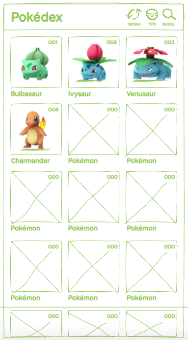
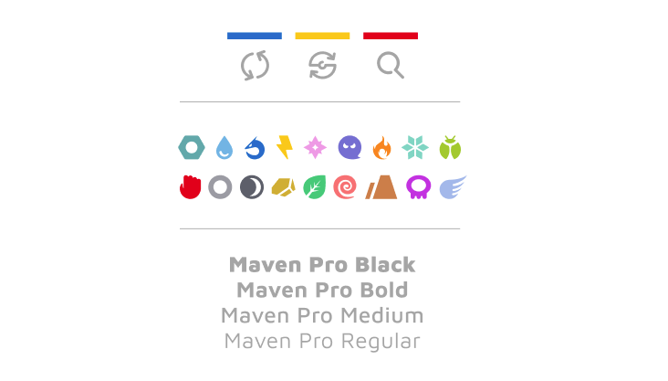

# Data Lovers

## Índice

* [1. Produto](#1-Produto)
* [2. Protopersona](#2-Protopersona)
* [3. História do Usuário](#3-História-do-Usuário)
* [4. Interface](#-Interface)
* [5. Funcionalidades](#-Funcionalidades)
* [6. PROTOTIPAÇÃO](#4-PROTOTIPAÇÃO)
* [7. REFERÊNCIAS](#5-REFERÊNCIAS)

***

## 1. Produto

Desenvolvemos uma página direcionada a jogadores iniciantes de Pokémon Go. Nela os usuários podem encontrar informações essenciais e de forma clara sobre pokémons encontrados no jogo.

Acesse a página no GitHub clicando na imagem abaixo:

## 2. Protopersona

>Necessidades do usuário

Para este produto criamos a pers**ANA**, que nos orientou sobre as necessidades mais básicas dos usuários e seu perfil:

**ANA**
Informações demográficas
* 24 anos;
* Estudante de Jornalismo;
* Estagiária em uma Agência;
* Mora em São Paulo, São Mateus;
* Trabalha no Brooklin e estuda no Mackenzie.

Comportamento
* Joga como passatempo no ônibus;
* Não consegue ir sentada então não pode estudar;
* Influenciada a jogar por amigos;
* Nunca viu o desenho animado Pokémon.

Necessidades
Conhecer os pokémons que encontra no jogo;
Acesso rápido enquanto joga no ônibus a caminho do trabalho, da faculdade ou na volta para casa.

## 3. História do Usuário

> Necessidades atendidas

Tendo como referência as necessidades da pers**ANA** elaboramos o seguinte épico para nossas três sprints de desenvolvimento:

>Conhecer a **imagem, nome, número e tipo** de todos os Pokémons de Kanto.  Poder **filtrar, ordenar** ou **buscar** os Pokémons que encontrar no jogo.
 

## 4. Interface

> Visualização de dados
Optamos por um modelo mobile first, pois por ser um jogo voltado para **dispositivos móveis** os usuários, como base na nossa protopersona, estariam buscando informações, em grande parte do tempo, diretamente em seus dispositivos enquanto jogam. 

## 5. Funcionalidades

>Objetivos de interação

Utilizando uma base de dados com os 151 pokémon de Kanto, oferecemos as seguintes funcionalidades de interação ao usuário:

* Como buscar o pokémon por nome;
* Ordenar os pokémon em uma lista alfabética ou numérica;
* Filtrar os pokémons por tipo e conhecer de maneira pontual seus comportamentos e fraquezas em comparação a outros tipos;
* Prcentagem de pokémons de Kanto por tipo, entendendo assim sua raridade.

## 6. PROTOTIPAÇÃO

### Benchmarking
>Análise de melhores práticas no mercado

Com o produto definido passamos para busca de referências visuais. 
Encontramos diversas soluções, a maioria baseada na identidade do jogo, porém descobrimos também referências à franquia Pokémon que nos inspiraram bastante.

Após o contato com diversos sites, fóruns e páginas ligadas ao universo do jogo, chegamos a conclusão de que um desenho de página minimalista traria maior destaque aos pokémons e comunicaria dados básicos de maneira mais efetiva.

Depois dessa decisão, somadas as necessidades do produto, chegamos aos seguintes componentes básicos:

* POKÉMON = a imagem, o nome, o número e o tipo;
* ORDENAÇÃO = ordenar os Pokémons por nome ou número do pokédex;
* FILTRO = filtrar por tipos;
* PESQUISA = buscar Pokémons pelo nome;

### UX
>Experiência do usuário

Adotamos uma solução de cards para exposição das informações do pokémon, com uma barra de navegação auxiliar para as demais funções de ordenação, filtro, pesquisa e voltar/início.

Pensando na disposição de botões em telas reduzidas estudamos o uso de ícones para as funções de navegação, somadas a palavras curtas reforçando sua leitura e aumentando assim sua acessibilidade:

* CARD = dados do pokémon;
* BOTÃO DE ORDEM = ícone com duas setas e palavra **Ordem**;
* BOTÃO DE FILTRO = ícone de uma pokebola e a palavra **Tipo**;
* ÁREA DE PESQUISA = ícone de lupa e a palavra **Busca**, área de pesquisa;
* BOTÃO INÍCIO = logotipo com função de reiniciar a página.

Para os submenus escolhemos usar botões e não uma área de seleção devido a área de clique padrão do usuário de aplicativos móveis. Também analisamos a acessibilidade de conceitos de ordenação e familiaridade de padrões visuais:

* ORDEM ALFABÉTICA: uso das letras do alfabeto A-Z e Z-A;
* ORDEM NUMÉRICA: uso dos números do pokédex 1-151 e 151-1;
* TIPO: uso do ícone do jogo somado ao nome.

Tomadas as decisões de fluxo de navegação iniciamos os desenhos de baixa fidelidade das telas e seus recursos. Terminadas as telas desenvolvemos uma entrevista para os testes de usabilidade. 
Teste: https://forms.gle/rZLDPkM2ejhVegSM6

Acesse o protótipo de baixa fidelidade clicando nas imagens abaixo:

 

O principal retorno que tivemos neste teste foi: o ícone de tipo (pokebola) mesmo com o texto auxiliar não estava reconhecível o bastante. Buscamos solucionar esta inconsistência na etapa de interface. 

   
### UI
>Interface do usuário

Tendo validado nosso protótipo e reunido referências visuais só nos restava aplicar estes conceitos nas escolhas do design de interface. 

Seguindo noções de material e flat design projetamos a interface com alguns aspectos em mente:

* **CORES:** a paleta de cores dos símbolos foi herdada dos tipos do jogo, porém a tríade azul, amarelo e vermelho tal como as três equipes do jogo foram ressignificadas como os três botões do navegador.
* **ÍCONES:** os ícones dos tipos foram baseados no jogo mas em sua versão flat, já os ícones de navegação são arredondados e não fecham em si, dando a ideia de busca.
* **TIPOGRAFIA:**S buscando unidade entre as informações mas com pesos visuais diferentes adotamos uma família extensa com traço arredondados e legibilidade em tamanhos reduzidos.

[]

Baseadas em nossas referências chegamos a duas opções de desenhos de interação. Para validação desenvolvemos uma entrevista de teste A x B.
Teste: https://forms.gle/2AcsHgqPXQZt3cvq7

Acesse o protótipo de alta fidelidade clicando nas imagens abaixo:
 
Teste A: https://www.figma.com/proto/HXPRzYK8oAl1zHjUNvycWB/Pok%C3%A9dex?node-id=1%3A2&scaling=scale-down

Teste B:
https://www.figma.com/proto/HXPRzYK8oAl1zHjUNvycWB/Pok%C3%A9dex?node-id=69%3A377&scaling=scale-down

[![testes-A] (img/Home-A)] [![testes-B] (img/Home-A)]

## 7. REFERÊNCIAS:

www.pokemon.co.jp
www.pokemongo.jp
zukan.pokemon.co.jp
www.fandom.com
