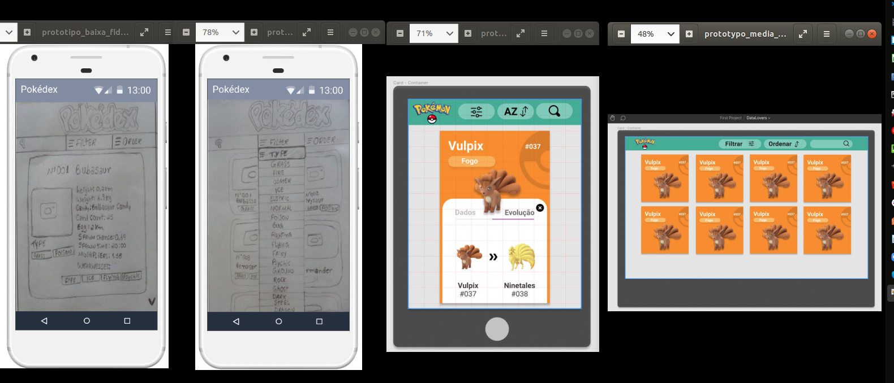

## Índice
* [0. Link do projeto](#0.Link-do-projeto) 
* [1. Contextualização](#1-Contextualização)
* [2. Objetivos de aprendizagem](#2-Objetivos-de-aprendizagem)
* [3. Histórias de Usuário](#3-Histórias-de-Usuário)
* [4. Desenho da Interface](#4-Desenho-da-Interface)
* [5. Ferramentas utilizadas](#5-Ferramentas-utilizadas)
* [6. Autoras](#6-Autoras)
* [7. Créditos](#7-Creditos)

 ## 0.Link do projeto
 :pushpin:  Clique [___ F A Z E R ___](https:) para acessar o webapp.

## 1. Contextualização :paperclip:

Por que ___dados___ são tão importantes?A resposta é simples: os dados são importantes porque são o combustível de tecnologias que estão revolucionando o mundo atual, como por exemplo Inteligência Artificial e Machine Learning. E produzimos dados como nunca antes na história. A cada novo dia geramos aproximadamente 2.5 milhões de terabytes de dados e cerca de 90% dos dados que existem hoje foram gerados apenas durante os últimos dois anos (_Referência:_ [Forbes](https://www.forbes.com/sites/bernardmarr/2018/05/21/how-much-data-do-we-create-every-day-the-mind-blowing-stats-everyone-should-read)). Portanto, é inegável que vivemos na **Era dos Dados**. Apesar disso, os dados por si só são de pouca utilidade. Para que possamos explorar todo o seu potencial é necessário converter grandes bancos de dados em **informação**, explorando, analisando e processando esses dados e tornando-os dessa forma compreensíveis para o usuário. E uma forma simples de fazer isso é criando _interfaces_ e _visualizações_. O ___objetivo geral___ do projeto foi construir uma interface web para visualização e processamento de dados desenvolvido em _vanilla Javascript_ sobre o jogo [Pokemon GO](http://pokemongolive.com). A aplicação deve ser capaz de manipular e processar um banco de dados composto por 151 pokémons da região de Kanto e suas principais estatísticas individuais. A página deve permitir não só a visualização dos dados, mas também gerar informações básicas sobre o jogo, permitindo que @ usuári@ explore o banco de dados pela aplicação de filtros, ordenação de dados e obtenção de estatísticas básicas (médias, máximos e mínimos) das características dos personagens. 

## 2. Objetivos de aprendizagem :mag:
Os principais objetivos de aprendizagem e as habilidades desenvolvidas durante a execução do projeto foram:
* Usar **metodologia ágil** para planejar e executar o projeto, dividindo as sessões de trabalho em _sprints_;
* Adquirir conhecimentos básicos em **UX**;
* Criar e implementar **testes de usabilidade**, iterando o desenho do produto a partir desses resultados;
* Adquirir conhecimentos básicos em **UI** e implementar protótipos de baixa, média e alta fidelidade;
* Desenvolver noções de **responsividade**;
* Manipular **arrays e objetos**;
* Manipular o **Document Object Model - DOM** (árvores de elementos do HTML) e manejar eventos sobre eles;
* Configurar e implementar **testes automáticos** unitários;
* Entender os benefícios e complexidades de **trabalhar em equipe** em um
  ambiente de incerteza.

## 3. Histórias de Usuário 	:girl:
Para entender que tipo de aplicação deveríamos desenvolver, realizamos diferentes pesquisas em busca de referências para desenhar quem são @s potenciais usuári@s do app Pokemon GO e quais suas principais necessidades (___Referências utilizadas___: [Opinion Box](https://blog.opinionbox.com/pesquisa-pokemon-go-no-brasil/), [UOL](https://observatoriodocinema.uol.com.br/games/2016/07/pokemon-go-mais-de-60-dos-jogadores-sao-mulheres-revela-pesquisa), [Media Play News](https://www.mediaplaynews.com/study-women-represent-almost-half-of-gamers-but-have-different-tastes/)). Depois, traçamos os seguintes modelos de _persona_ e histórias de usuári@:

**Persona:** jovens (predominantemente mulheres) de 15 - 30 anos que moram em localidades com fácil acesso à internet (provavelmente em ambientes urbanos), têm bastante familiaridade com recursos digitais e usam o celular para consumir aplicativos de jogos em momentos ociosos (para “passar o tempo”). Também usam o dispositivo para buscar referências básicas de suas séries, filmes e games preferidos. Possuem conhecimento básico-intermediário em Pokemon GO e estão interessadas em conhecer todos os personagens do jogo para tomarem boas decisões sobre quais pokemon capturar e completar seu pokedex. Também querem conhecer os diferentes tipos e habilidades dos personagens para tomar boas decisões sobre qual deles escolher para as batalhas com outr@s jogador@s.

**História Épica da Usuária:** eu como jogadora gostaria de conhecer detalhadamente todos os pokemons. Também gostaria de conhecer o tipo e as características individuais de cada um deles, para poder compará-los em função de suas habilidades individuais e tomar boas decisões sobre quais eu quero capturar e treinar.

**Histórias de Usuária:**
* Eu como jogadora preciso conhecer todo os pokemons da região de Kanto.
* Eu como jogadora quero saber quais os tipos de pokemon existem e quais pokemons pertencem a cada tipo.
* Eu como jogadora quero filtrar os pokemons de um tipo específico.
* Eu como jogadora quero ordenar os pokemons em função do seu nome ou número. 
* Eu como jogadora quero poder voltar ao deck de cards inicial a qualquer instante.
* Eu como jogadora quero usar em todos os meus dispositivos eletrônicos (smartphone, tablet e computador).

## 4.Desenho da Interface :pencil:
Após prototipação da página e pesquisas de usabilidade com 14 participantes voluntárias para detectar potenciais falhas de UI e UX, decidimos construir a **interface final da página em um formato de _'deck'_**: uma coleção principal de _cards_ dos pokemons com as suas características principais (_pokedex_). A(o) usuári@ pode obter estatísticas adicionais sobre um pokemon clicando sobre o seu _card_ inicial (_card_ expandido). No topo da página há uma área de botões __Home, Filtrar e Ordenar)_. O filtro de dados é baseado no tipo de pokemon, e @ usuári@ pode ordenar os _cards_ pelo nome ou número do pokemon em ordem crescente ou decrescente. A página é _responsiva_. 

  Veja abaixo um resumo da **evolução da interface do projeto**, com os protótipos de baixa, média e alta fidelidade:

Veja também a **lista das principais limitações** identificadas durante o projeto e que exigiram ajustes técnicos ou de planejamento da página. Essas limitações foram detectadas durante a pesquisa de usabilidade, pelo corpo técnico do programa (mentores) durante as _office hours_ ou surgiram da nossa própria percepção durante o andamento das atividades:
* Tamanho reduzido dos elementos da página (fonte e botões);
* Localização inicial do botão de fechamento do _card_ ;
* Excesso de características apresentadas no _card_ principal (problemas estéticos);
* Excesso de características apresentadas no _card_ expandido (alta complexidade do layout e limitação de tempo para estruturar as telas de evolução e fraqueza);
* Redefinição da área de botões com eliminação da funcionalidade de busca;
* Número de cliques para chegar ao _card_ desejado;

E aqui está a **interface final** em diferentes dispositivos:
___ F A Z E R ___

## 5. Ferramentas utilizadas :wrench:
* [Node.js](https://nodejs.org/en/) - plataforma de desenvolvimento.
* [VSCode](https://code.visualstudio.com/) - editor de texto
* [NPM](https://www.npmjs.com/) - gerenciador de pacotes
* [Jest](https://jestjs.io/pt-BR/) - framework de testes unitários
* [Figma](https://www.figma.com/) e [MarvelApp] (https://marvelapp.com/) - plataforma de prototipagem
* [Trello](https://trello.com/pt-BR) - gerenciador de projeto

## 6. Autoras :email:
Jucilene Barros Silva: barrossilvajucilene@gmail.com 
Nathalia Monalisa Francisco: nathaliamonalisa@gmail.com 

## 7. Créditos:
* Imagem da persona: br.freepik.com
* Imagem dos botões Filtrar e Ordenar: flaticon.com
* Imagem do logotipo: pokemon.com/br/
