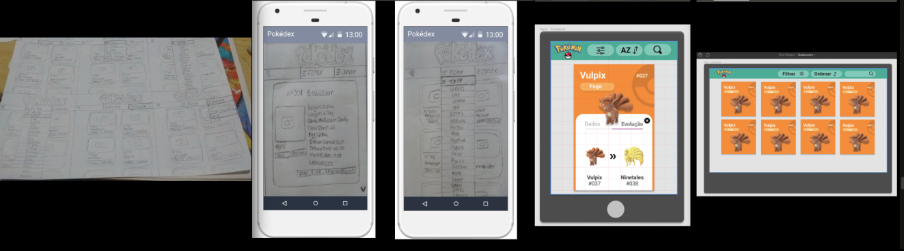

## Índice
* [0. Página do projeto](#0.pagina-do-projeto) 
* [1. Contextualização](#1-contextualização)
* [2. Objetivos e Resumo do projeto](#2-objetivos-resumo)
* [3. Persona e Histórias de Usuário](#3-persona-historias-usuario)
* [4. Desenho da Interface](#4-desenho-interface)
* [5. Ferramentas utilizadass](#5-ferramentas-utilizadas)
* [6. Autoras](#7-autoras)
* [7. Créditos](#9-creditos)

 ## 0.Link do projeto
 :pushpin:  Clique [aqui](https://nmonalisa.github.io/SAP004-cipher/) para acessar o webapp.

## 1. Contextualização :paperclip:

Por que dados são tão importantes?A resposta é simples: os dados são importantes porque são o combustível das tecnologias que estão revolucionando o mundo atual, como a Inteligência Artificial e o Machine Learning. E produzimos dados como nunca antes na história. É estimado que a cada novo dia geramos aproximadamente 2.5 milhões de terabytes de dados, e de acordo com a [Forbes](https://www.forbes.com/sites/bernardmarr/2018/05/21/how-much-data-do-we-create-every-day-the-mind-blowing-stats-everyone-should-read), cerca de 90% dos dados que existem hoje foram gerados apenas durante os últimos dois anos. Portanto, é inegável que vivemos na **Era dos Dados**. Apesar disso, os dados por si só são de pouca utilidade. Para que possamos explorar todo o seu potencial e torná-los compreensíveis para o usuário é necessário converter grandes bancos de dados em **informação**, explorando, analisando e processando esses dados. E uma forma simples de fazer isso é criando _interfaces_ e _visualizações_.

## 2. Objetivos e resumo do projeto :mag:
O **objetivo geral** do projeto foi construir um ambiente _(página web)_ de visualização e informação sobre o jogo [Pokemon GO](http://pokemongolive.com) desenvolvido em _vanilla Javascript_. A aplicação deve ser capaz de manipular e processar um banco de dados composto por 151 pokémons da região de Kanto e suas principais estatísticas individuais utilizadas pel@s usuári@s durante o jogo. A página deve oferecer não só a visualização das informações, mas também deve permitir a aplicação de filtros e ordenação de dados, ***além da obtenção de estatísticas básicas (máximos e mínimos)*** sobre as características dos personagens. 

Já os principais **objetivos de aprendizagem** e as habilidades básicas desenvolvidas durante a execução do projeto foram:
* Implementar **metodologia ágil** para o planejamento e execução do projeto;
* Adquirir conhecimentos básicos em **UX**, definindo histórias de usuário, suas definições de pronto (_definition of done_) e critérios de aceitação;
* Criar e implementar **testes de usabilidade**, usando o resultado desses testes para iterar o desenho do produto;
* Adquirir conhecimentos básicos em **UI** e implementar protótipos de baixa, média e alta fidelidade;
* Desenvolver noções de **responsividade**;
* Manipular **arrays e objetos**;
* Manipular o **Document Object Model - DOM** (árvores de elementos do HTML) e manejar eventos sobre eles;
* Configurar e implementar testes automáticos unitários;
* Entender os benefícios e complexidades de **trabalhar em equipe** em um
  ambiente de incerteza.

## 3. __Persona__ e Histórias de Usuário:
Antes de iniciar nosso projeto fizemos uma pesquisa em busca de referências para compreender quem são @s potenciais usuári@s do app Pokemon GO e quais suas principais necessidades (Referências: [Opinion Box](https://blog.opinionbox.com/pesquisa-pokemon-go-no-brasil/), [UOL](https://observatoriodocinema.uol.com.br/games/2016/07/pokemon-go-mais-de-60-dos-jogadores-sao-mulheres-revela-pesquisa), [Media Play News](https://www.mediaplaynews.com/study-women-represent-almost-half-of-gamers-but-have-different-tastes/)). Depois, construímos o modelo d@s potenciais principais visitantes da nossa página (__persona__) e definimos as histórias dest@ usuári@ para servir como diretriz da sua construção:

* **Persona:** jovens (predominantemente mulheres) de 15 - 30 anos que .moram em localidades com fácil acesso à internet (provavelmente em ambientes urbanos), têm bastante familiaridade com recursos digitais e usam o celular para consumir aplicativos de jogos em momentos ociosos (para “passar o tempo”). Também usam o dispositivo para buscar referências básicas de suas séries, filmes e games preferidos. Possuem conhecimento básico-intermediário em Pokemon GO e estão interessadas em conhecer todos os personagens do jogo para tomarem boas decisões sobre quais pokemon capturar e completar seu pokedex. Também querem conhecer os diferentes tipos e habilidades dos personagens para tomar boas decisões sobre qual deles escolher para as batalhas com outr@s jogador@s.

**História Épica:** eu como jogadora gostaria de conhecer detalhadamente todos os pokemons. Também gostaria de conhecer o tipo e as características individuais de cada um deles, para poder compará-los em função de suas habilidades individuais e tomar boas decisões sobre quais eu quero capturar e treinar.

**Histórias de Usuário:**
* 1.Eu como jogadora preciso conhecer todo os pokemons da região de Kanto.
* 2.Eu como jogadora quero saber quais os tipos de pokemon existem e quais pokemons pertencem a cada tipo.
* 3.Eu como jogadora quero filtrar os pokemons de um tipo específico.
* 4.Eu como jogadora quero ordenar os pokemons em função do seu nome ou número. 
* 5.Eu como jogadora quero poder voltar ao deck de cards a qualquer instante.
* 6.Eu como jogadora quero fazer usar a página a partir dos meus diferentes dispositivos eletrônicos (celular, tablet e laptop).

## 4.Desenho da Interface:
Após a prototipação e testes de usabilidade, a interface final da página foi construída em um formato de 'deck': uma coleção de _cards_ dos pokemons com as características básicas de cada um deles (__pokedex__). O usuário pode obter estatísticas adicionais sobre um pokemon clicando sobre o card. No topo da página há uma área de botões __(Home, Filtrar e Ordenar)__. O filtro é baseado no grupo do pokemon, e o usuário pode ordenar os cards (pelo nome ou número do pokemon) em ordem crescente ou decrescente. Além disso, a página é responsiva. Ou seja, a interface foi adaptada para uma boa visualização em dispositivos de diferentes tamanhos. Veja abaixo a evolução da interface do projeto:

E a interface final em diferentes dispositivos:

## 5. Ferramentas utilizadas :wrench:
* [Node.js](https://nodejs.org/en/) - plataforma de desenvolvimento
* [VSCode](https://code.visualstudio.com/) - editor de texto
* [NPM](https://www.npmjs.com/) - gerenciador de pacotes
* [Jest](https://jestjs.io/pt-BR/) - framework de testes unitários
* [Figma](https://www.figma.com/) e [MarvelApp] (https://marvelapp.com/) - plataforma de prototipagem
* [Trello](https://trello.com/pt-BR) - gerenciador de projeto

## 6. Autoras :email:
Jucilene Barros Silva: barrossilvajucilene@gmail.com
Nathalia Monalisa Francisco: nathaliamonalisa@gmail.com 

## 7. Créditos:
* Imagem da persona: br.freepik.com
* Imagem dos botões Filtrar e Ordenar: flaticon.com
* Imagem do logotipo: pokemon.com/br/
